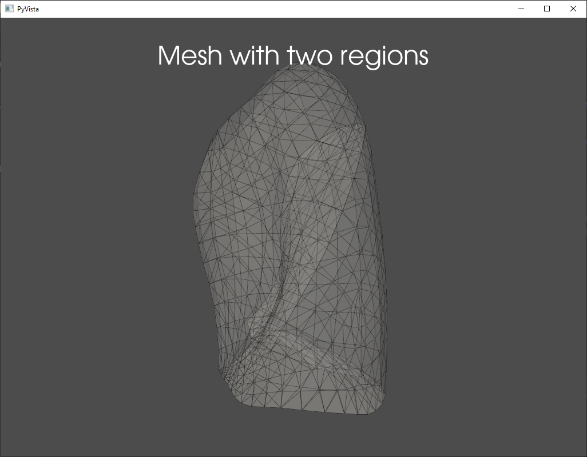

========================
Extract Enclosed Regions
========================

The function extract_enclosed_regions is used to identify the regions within a surface mesh that
are separated by walls. Consider the following example:

First we construct an example mesh composed of two distinct regions:

.. code-block:: python

    mesh_filenames = ["meshes/mock_lung/lower_lobe_of_left_lung_surface.stl",
                      "meshes/mock_lung/upper_lobe_of_left_lung_surface.stl"]
    meshes = [pv.read(filename) for filename in mesh_filenames]
    merged = remove_shared_faces_with_merge(meshes, keep_one=True)

We can view this as follows:

.. code-block:: python

    p = pv.Plotter()
    p.add_mesh(merged, show_edges=True, opacity=0.2)
    p.add_title("Mesh with two regions")
    p.show()

We then extract the enclosed regions:

.. code-block:: python

    regions = extract_enclosed_regions(merged)

And view the result

.. code-block:: python

    p = pv.Plotter()
    cmap = matplotlib.cm.get_cmap("Set1")
    for i, mesh in enumerate(regions):
        p.add_mesh(mesh, style="wireframe", color=cmap(i), label=f"Region {i}")
    p.add_title("Enclosed regions")
    p.add_legend()
    p.show()

.. image:: ../_static/enclosed_regions.png