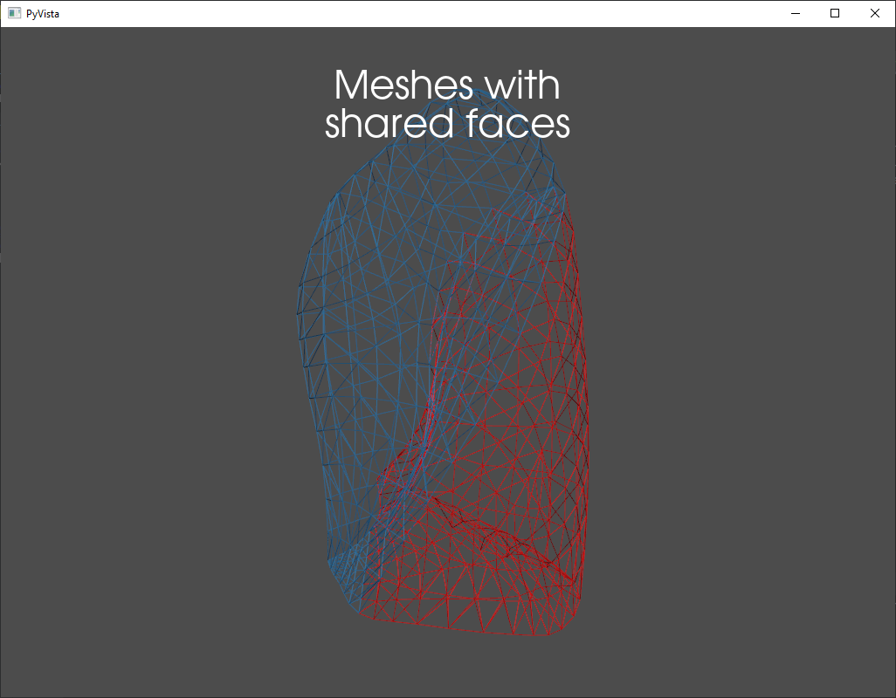
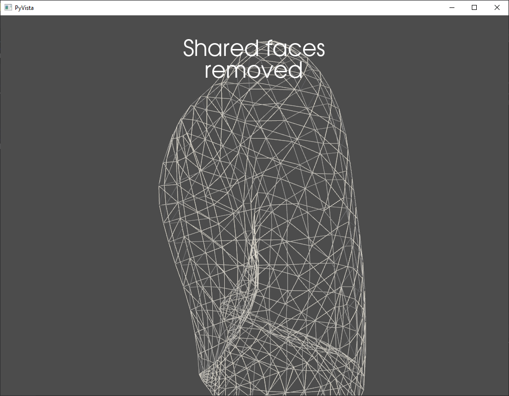

===================
Remove Shared Faces
===================

We can use remove_shared_faces_with_merge to isolate the faces that a list of meshes share, and
remove them.

To demonstrate, we load two meshes that have some identical faces:

.. code-block:: python

    mesh_filenames = ["meshes/mock_lung/lower_lobe_of_left_lung_surface.stl",
                      "meshes/mock_lung/upper_lobe_of_left_lung_surface.stl"]
    meshes = [pv.read(filename) for filename in mesh_filenames]

    p = pv.Plotter()
    cmap = cm.get_cmap("Set1")
    for i, mesh in enumerate(meshes):
        p.add_mesh(mesh, style="wireframe", color=cmap(i), label=f"Mesh {i}")
        p.add_title("Meshes with\nshared faces")

We then use remove_shared_faces_with_merge, and the meshes are merged into one, with their
shared faces removed.

.. code-block:: python

    merged = remove_shared_faces_with_merge(meshes)

    p = pv.Plotter()
    p.add_mesh(merged, style="wireframe")
    p.add_title("Shared faces\nremoved")
    p.show()

